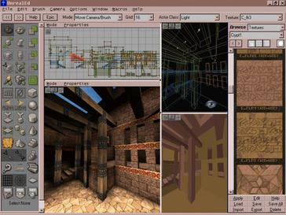
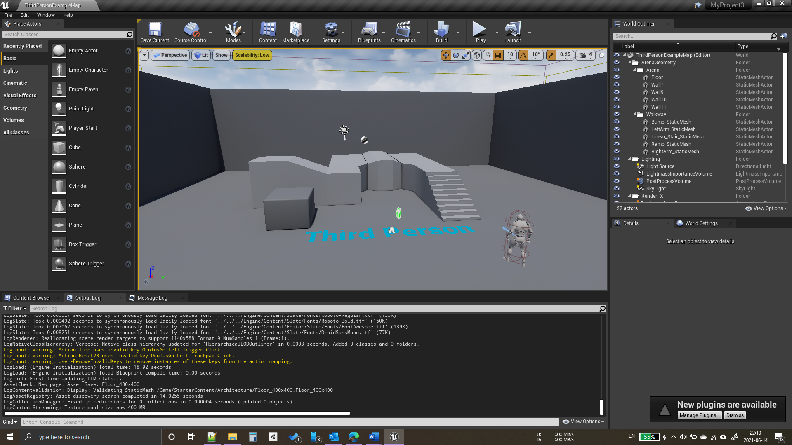
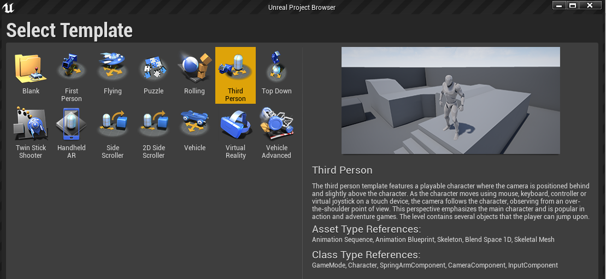
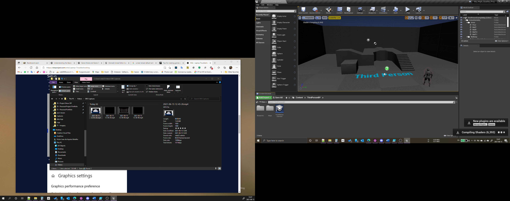
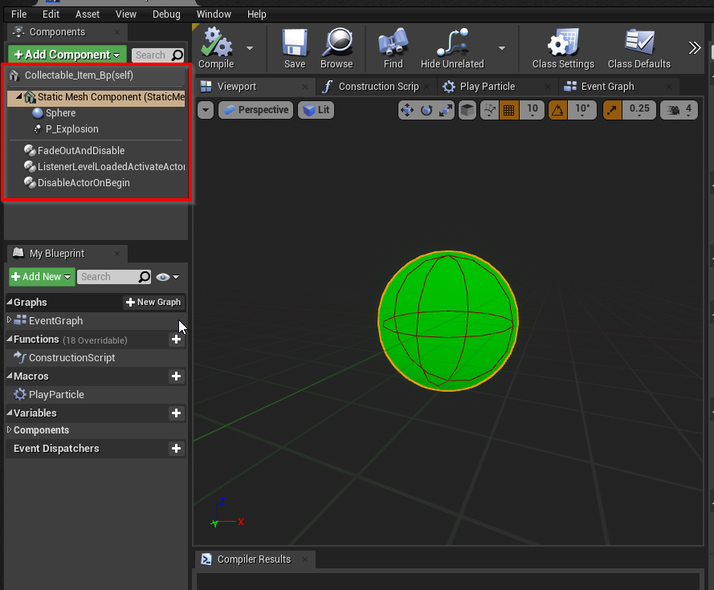
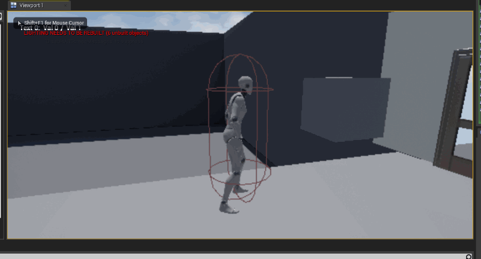
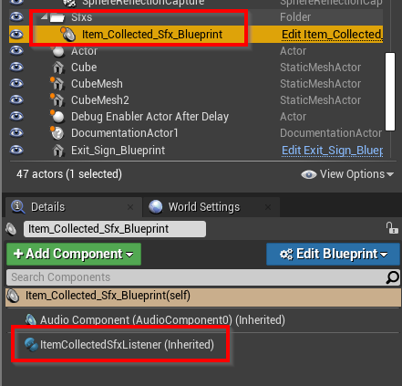
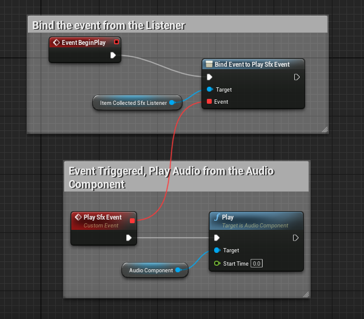
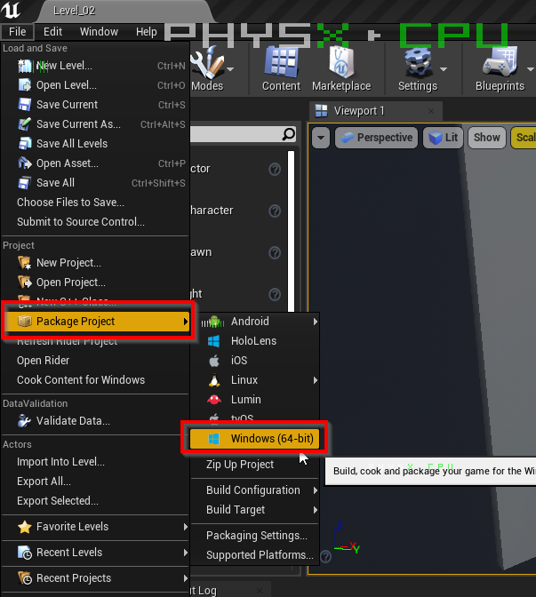
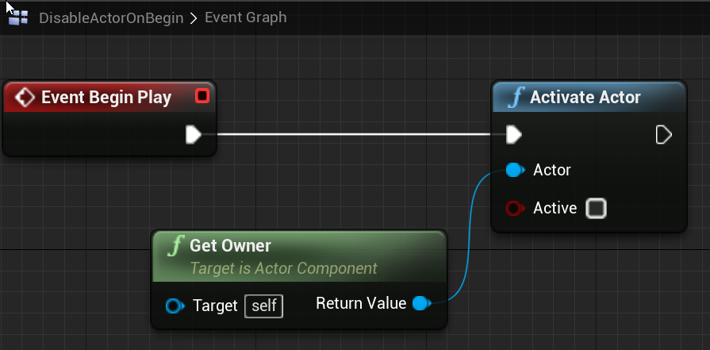

# Unreal Learning Outcome for Saxion's the Personal Portfolio 4

### This doc was converted from the original docx file and some content was missing, so for the full content:

*   [Victor Leao - 481212 - Unreal PP4.docx (https://1drv.ms/w/s!AgtgYYr28Kkgg44ea9TYCIbt-N602A?e=4S5sMe)](https://1drv.ms/w/s!AgtgYYr28Kkgg44ea9TYCIbt-N602A?e=4S5sMe)

<table><tbody><tr><td><strong>Week 4.3</strong></td><td><strong>Research</strong></td></tr><tr><td>Week 4.4</td><td>Project / Char Controller / Level / HUD</td></tr><tr><td>Week 4.5</td><td>Collectibles / Components / Tools</td></tr><tr><td>Week&nbsp; 4.6</td><td>Collectibles Logic / Open Door / Door's Leds / Material dressing</td></tr><tr><td>Week 4.7</td><td>Adding Sfx / End Game</td></tr></tbody></table>

## Learning Outcome 2

"As a game developer, I want to improve my knowledge in **Unreal Engine**, for this, I want to develop a simple 3D game level with features like collect/delivery items, UI, and character controller. For this tool, I'll spend 40h of working/studying time. With this achievement, I'll have a better understanding of Unreal Engine and the deliverable will be a small demo scene."

## Introduction

This document is a walkthrough of my learning process, I've already used Unreal before but just to test it and see "how it like". Never spent more than an hour on it.

## What is this document, and what it's not

This document is not a comprehensive step-by-step on how to create a simple game, neither a tutorial. It's more a step-by-step of the learning process.

This was not written linearly too, some remarks/annotations were created during the learning accordingly with the insights acquired.

## Glossary

| Term | Meaning |
| --- | --- |
| **Bp** | Blueprint |

# Week 4.3

## The Unreal Engine

*   First Release in 1998 with the game Unreal
*   UnrealScript (UScript) and **UnrealEd** (a level editor)

|  

Figure - UnrealEd (1998)

|

Figure - Unreal 4.26 (2021)

|  
| --- | --- |

PS:

## Unreal for Unity Developers

List of some resources to startup

*   [https://docs.unrealengine.com/4.26/en-US/Basics/UnrealEngineForUnityDevs/](https://docs.unrealengine.com/4.26/en-US/Basics/UnrealEngineForUnityDevs/)
    *   Unity users **must read it.**
    *   Unreal Official Documentation
    *   Quick Glossary Section
*   [https://www.unrealengine.com/en-US/onlinelearning-courses/making-the-switch-from-unity-to-unreal-engine](https://www.unrealengine.com/en-US/onlinelearning-courses/making-the-switch-from-unity-to-unreal-engine)
    *   2 hours length
    *   Split into topics, short videos of approximately 5 minutes each
    *   Unreal Official Source

## Understanding the Basics

The Unreal official documentation is the "first stop" to start learning it. Doesn't need to read it all but use it for consulting

*   [https://docs.unrealengine.com/4.26/en-US/Basics/](https://docs.unrealengine.com/4.26/en-US/Basics/)

## Unreal Terminology

*   [https://docs.unrealengine.com/4.26/en-US/Basics/UnrealEngineTerminology/](https://docs.unrealengine.com/4.26/en-US/Basics/UnrealEngineTerminology/)
    *   Actor? Pawn? Character?
    *   **Game mode**
    *   Player State
    *   Game State

## Game Mode, Game State, Player State

*   A lot of premade rules
*   Customizable
*   Designer friendly

# Week 4.4

## Starting a Project

Before reading the documentation, I believe 99% of users install the Engine and try to "start doing things". I did the same and easily got lost.

Figure - Lots f Templates

### First Try

1.  Third-person Template Project
2.  High Quality
3.  Ray Tracing Enabled
4.  Starter Content Pack

### Create Some Game Templates and Test Explore Them

1.  Third-person, Flying, Side Scroller, Top Down
2.  High Quality
3.  Ray Tracing Disabled
4.  Starter Content Pack

## The IDE

My first try to open Visual Studio for UE4 was not satisfactory:

*   Slow
*   Undesirable code completion

## Switch from Visual Studio to Jetbrains CLion

*   [https://blog.jetbrains.com/clion/2016/10/clion-and-ue4/](https://blog.jetbrains.com/clion/2016/10/clion-and-ue4/)
*   [https://manenko.com/2021/05/18/how-to-make-unreal-engine-work-correctly-with-clion.htm](https://manenko.com/2021/05/18/how-to-make-unreal-engine-work-correctly-with-clion.htm)

## Rider for Unreal (preview edition) - Windows

*   [https://www.jetbrains.com/lp/rider-unreal/](https://www.jetbrains.com/lp/rider-unreal/)
    *   Preview Edition download
*   [https://www.jetbrains.com/help/rider/Unreal_Engine__Before_You_Start.html#rider_ue_plugins](https://www.jetbrains.com/help/rider/Unreal_Engine__Before_You_Start.html)
    *   Instructions on how to use it
    *   Works great!
*   (Mouse)
*   Easy going how to understand the UI + Elements

4

5

6

7

# 5

### a Collectable Item

Features:

*   Load Disabled
*   Enable after some event happen
    *   Level loaded or
    *   After a delay or
    *   Player do something
*   Disable when the Player Touch it
    *   Play the particle effect
    *   Fade out the object

From scratch (only for guidance)

*   Drag a Sphere to the Level
*   Convert it to an Actor **Blueprint**
*   Add a Sphere Collision Component
*   Add an Explosion Particle
    *   Unset: Activation -> Auto Activate (not play on start)
*   Create some reusable Blueprints (Appendix 1)
    *   Listener to Activate the Actor when the Level is loaded (could be another event)
    *   Disable Actor On Begin
    *   Fade Out And Disable
    *   Raise Event when touched by Player

Figure - Collectible Bp Structure

# Week 4.6

### Creating Tween Components for "Perfumary" (Set Dressing)

Even for a simple prototype, it's good to look through some "set dressing" features.With some research in the Unreal MarketPlace no "free" asset was found.

Figure - MArketplace

So, some components were created.

*   Tween Base
*   Tween Rotate (can extend to TweenMove, etc)
*   Tween Ease Out Elastic Scale

These Bps can be added to an Actor and be reusable (Designer Friendly)

Figure - A Tween Component with some parameter

Figure - Tween Scale Elastic Ease Out Example

### Collectibles Logic

1.  Collectable\_Manager\_Blueprint
    *   Designer feed the "Total List" var in the Bp with the Colelctibles Items in the Level (Figure 12)
    *   Listen to Item Touched Events
    *   Raise Item Collected Event (to other Actors, the UI, Sfx, etc)
        *   Door's leds light up
    *   Management (Count) Items collected
    *   Raise Event when all items have been collected
        *   Door Bp Open

Figure - Collectable Manager

Figure - Getting Items and Opening the door

### Creating the Exit Door

*   Re-using the starter pack Door Mesh
*   Re-using a TweenRotate component
*   Re-using the **ListenerAllCollectibleTakenBase**
*   Extended to _DoorListenetAllCollected_
*   When the player pickup all collectibles, the Collectibles Manager raise an Event
    *   The door has a listener to it and the TweenRotate rotates the door (with a small delay)

### Creating the Door's LEDs

*   Simple spheres with an unlit material and a colored light
*   Listen to the Collectibles Manager Event (Item Taken Event)
    *   Change the color of the light (using Material Instancing)

### Creating the End Level Trigger Box

*   After the exit door, a box trigger raises an _**End Level**_ _**Tigger Touched**_ event when the player touches it
*   _Level\_End\_Controller\_Blueprint_ listens to this event and raises an _**End Level Event.**_
    *   _HUD_ _FadePanel_ _plays to fade the screen to_ _black_
    *   _Level\_End\_Controller\_Blueprint_ opens the next level (after a small delay)

### Creating the Resolution Screen

*   A HUD element, just a fade panel, some text and Reset/Quit Buttons
*   The last level loads the Resolution Level and the game ends

# Week 4.7

## Adding Sfx

*   https://docs.unrealengine.com/4.26/en-US/WorkingWithMedia/Audio/
    *   Extensive docs about audio, not necessary for prototyping
*   [https://www.youtube.com/watch?v=u1iwQBwafNI](https://www.youtube.com/watch?v=u1iwQBwafNI)
    *   A simple tutorial, doesn't need to watch it completely
    *   Easy to add a music

#### Footsteps

*   Added in the Run Animation, synchronized with the feet

Figure - Built in Play Audio Event attached to the key frame

*   Same for jump sound

#### Collectables Sfxs

*   Re-using the **ListenerCollectibleTakenBase**
*   Extended to _ItemCollectedSfxListener_

_Door Opening Sfx_

*   Re-using the _**DoorListenetAllCollected**_
*   Plays the audio component attached to the door Bp

Figure - Structure Example

Figure - Play Audio using Event

### Building the game

*   Straight forward
*   [https://www.youtube.com/watch?v=4b8Q6DwqEKc](https://www.youtube.com/watch?v=4b8Q6DwqEKc)
    *   Video tutorial points some interesting fields to fill

# The Build

# Appendix 1

Some reusable Components and Functions

## Blueprint Components

#### Fade Out And Disable Actor (Component)

Figure - Figure - Fadeout and Disable Actor Component Bp

#### Disable Actor On Begin (Component)

#### Listener Level Loaded And Activate Actor

*   AfterLevelLoaded\_Event is raised somewhere else, is not the responsibility of this Bp Component to deal with it.

#### Tweens Components

*   Tween Elastic Ease Out
*   Tween Rotate

## Blueprint Library

*   Collection of reusable Bp functions
*   It's not a Blueprint
*   Add -> Blueprints -> Blueprint Function Library

#### Activate Actor (Actor, boolean)

*   Enable/Disable the set of built-in functions below:
*   Set Actor Tick Enabled
*   Set Actor Enable Collision
*   Set Actor Hidden in Game

Figure - Blueprint flow

---
