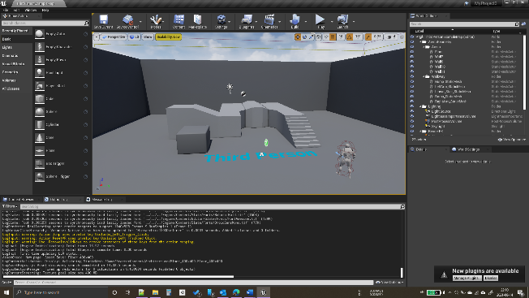
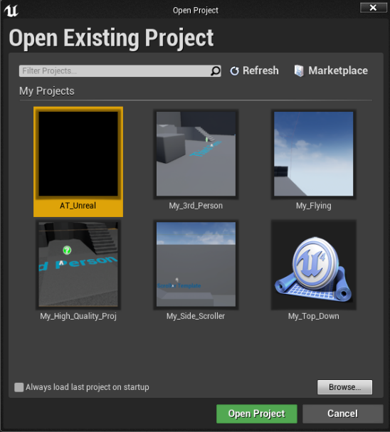
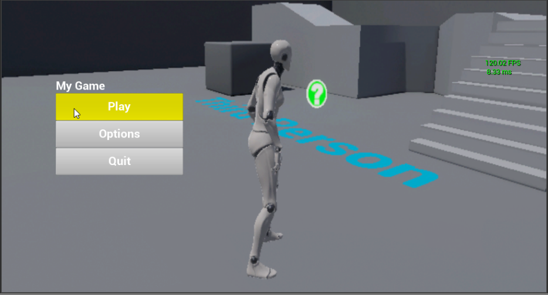
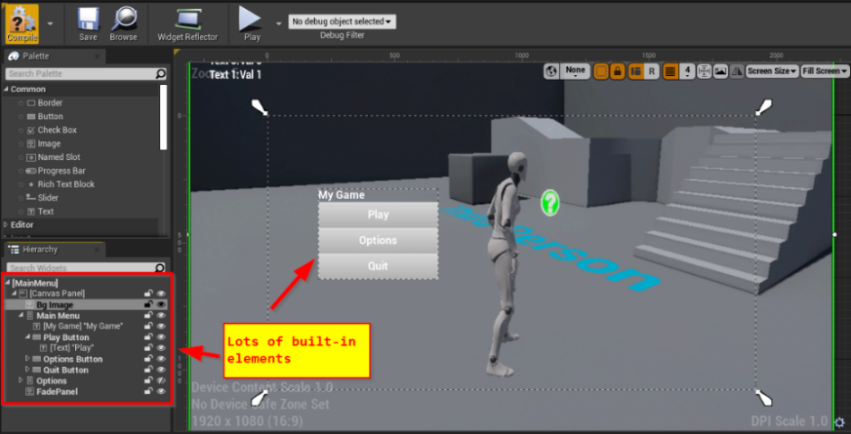
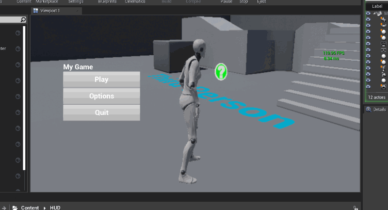
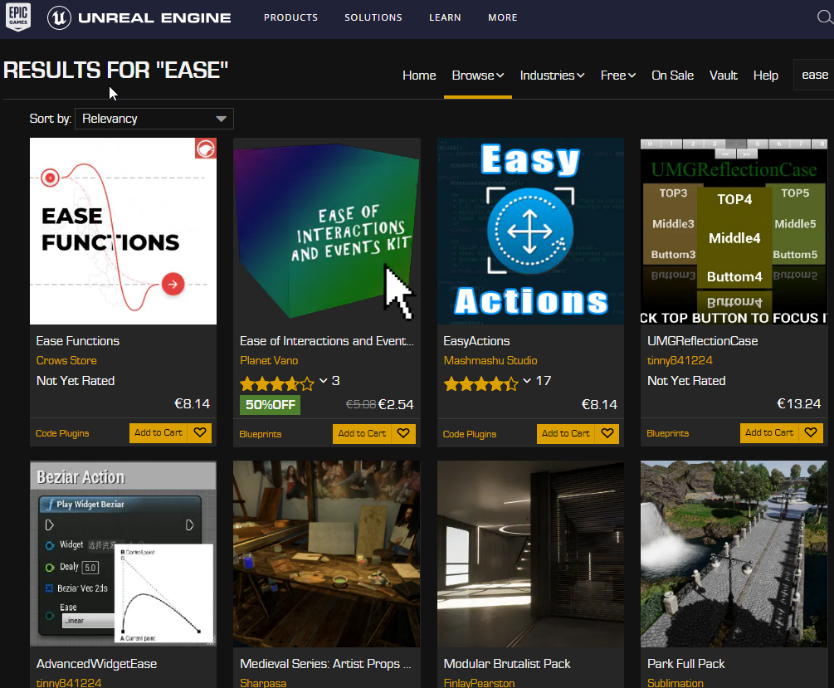
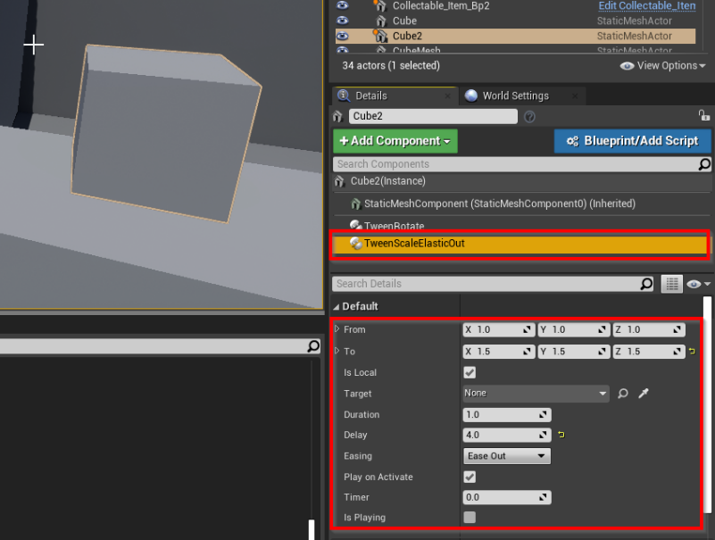
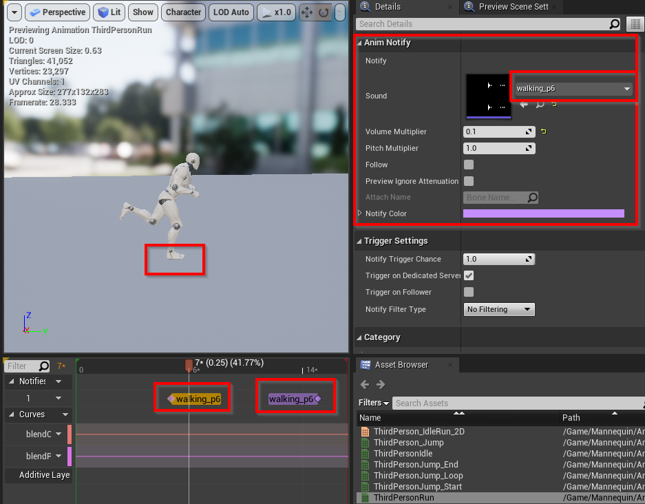
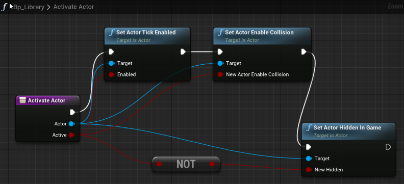

# Victor Leao - 481212 - ECM2V.Ec - Personal Portfolio 4

### This doc was converted from the original docx file and some content was missing, so for the full content:

*   [Victor Leao - 481212 - Unreal PP4.docx (https://1drv.ms/w/s!AgtgYYr28Kkgg44ea9TYCIbt-N602A?e=4S5sMe)](https://1drv.ms/w/s!AgtgYYr28Kkgg44ea9TYCIbt-N602A?e=4S5sMe)

---
| Week 4\.3 | Research                                                         |
| Week 4\.4 | Starting a Project / Char Controller / Level / HUD               |
| Week 4\.5 | Collectibles / Components / Tools                                |
| Week 4\.6 | Collectibles Logic / Open Door / Door's Leds / Material dressing |
| Week 4\.7 | Adding Sfx / End Game                                            |

## Learning Outcome 2

"As a game developer, I want to improve my knowledge in **Unreal Engine**, for this, I want to develop a simple 3D game level with features like collect/delivery items, UI, and character controller\. For this tool, I'll spend 40h of working/studying time\. With this achievement, I'll have a better understanding of Unreal Engine and the deliverable will be a small demo scene\."

## Introduction

This document is a walkthrough of my learning process, I've already used Unreal before but just to test it and see "how it like"\. Never spent more than an hour on it\.

## What is this document, and what it's not

This document is not a comprehensive step\-by\-step on how to create a simple game, neither a tutorial\. It's more a step\-by\-step of the learning process\.

This was not written linearly too, some remarks/annotations were created during the learning accordingly with the insights acquired\.

## Glossary

| Term   | Meaning   |
| ------ | --------- |
| **Bp** | Blueprint |

# Week 4\.3

## The Unreal Engine

- First Release in 1998 with the game Unreal
- UnrealScript \(UScript\) and **UnrealEd** \(a level editor\)

|   Figure 1 \- UnrealEd \(1998\) |   Figure 2 \- Unreal 4\.26 \(2021\) |
| :------------------------------------------------------------------------------------------: | :----------------------------------------------------------------------------------------------: |

PS: 

## Unreal for Unity Developers

List of some resources to startup

- [https://docs\.unrealengine\.com/4\.26/en\-US/Basics/UnrealEngineForUnityDevs/](https://docs.unrealengine.com/4.26/en-US/Basics/UnrealEngineForUnityDevs/)
  - Unity users **must read it\.**
  - Unreal Official Documentation 
  - Quick Glossary Section
- [https://www\.unrealengine\.com/en\-US/onlinelearning\-courses/making\-the\-switch\-from\-unity\-to\-unreal\-engine](https://www.unrealengine.com/en-US/onlinelearning-courses/making-the-switch-from-unity-to-unreal-engine)
  - 2 hours length
  - Split into topics, short videos of approximately 5 minutes each
  - Unreal Official Source

## Understanding the Basics

The Unreal official documentation is the "first stop" to start learning it\. Doesn't need to read it all but use it for consulting

- [https://docs\.unrealengine\.com/4\.26/en\-US/Basics/](https://docs.unrealengine.com/4.26/en-US/Basics/)

## Unreal Terminology

- [https://docs\.unrealengine\.com/4\.26/en\-US/Basics/UnrealEngineTerminology/](https://docs.unrealengine.com/4.26/en-US/Basics/UnrealEngineTerminology/)
  - Actor? Pawn? Character?
  - **Game mode**
  - Player State
  - Game State

## Game Mode, Game State, Player State

- A lot of premade rules
- Customizable
- Designer friendly

# Week 4\.4

## Starting a Project

Before reading the documentation, I believe 99% of users install the Engine and try to "start doing things"\. I did the same and easily got lost\.

Figure 3\- Lots f Templates

### First Try

1. Third\-person Template Project
2. High Quality
3. Ray Tracing Enabled
4. Starter Content Pack

### Create Some Game Templates and Test Explore Them

1. Third\-person, Flying, Side Scroller, Top Down
2. High Quality
3. Ray Tracing Disabled
4. Starter Content Pack

## The IDE

My first try to open Visual Studio for UE4 was not satisfactory:

- Slow
- Undesirable code completion

## Switch from Visual Studio to Jetbrains CLion

- [https://blog\.jetbrains\.com/clion/2016/10/clion\-and\-ue4/](https://blog.jetbrains.com/clion/2016/10/clion-and-ue4/)
- [https://manenko\.com/2021/05/18/how\-to\-make\-unreal\-engine\-work\-correctly\-with\-clion\.htm](https://manenko.com/2021/05/18/how-to-make-unreal-engine-work-correctly-with-clion.htm)

## Rider for Unreal \(preview edition\) \- Windows

- [https://www\.jetbrains\.com/lp/rider\-unreal/](https://www.jetbrains.com/lp/rider-unreal/)
  - Preview Edition download
- [https://www\.jetbrains\.com/help/rider/Unreal\_Engine\_\_Before\_You\_Start\.html\#rider\_ue\_plugins](https://www.jetbrains.com/help/rider/Unreal_Engine__Before_You_Start.html)
  - Instructions on how to use it
  - Works great\!

## The Character Controller

The Third Person Template Project already has a character controller with enough nice features:

- Character Controller
  - Humanoid Model
  - Animations \(Idle, Walking, Jumping\)
  - Input Handle \(WASD Movement\)
  - Camera Movement \(Mouse\)

## The Level

The Third Person Template Project already has some level structure:

- Floor
- Walls
- Stairs

## The HUD

- [https://docs\.unrealengine\.com/4\.26/en\-US/InteractiveExperiences/UMG/QuickStart/](https://docs.unrealengine.com/4.26/en-US/InteractiveExperiences/UMG/QuickStart/)
- Using this as a guide is possible to create some HUD like:
  - Main Menu
  - In\-Game HUD
  - Pause Menu

### Creating the Main Menu

- [https://docs\.unrealengine\.com/4\.26/en\-US/InteractiveExperiences/UMG/HowTo\.\.\.](https://docs.unrealengine.com/4.26/en-US/InteractiveExperiences/UMG/HowTo...)
  - Easy going how to understand the UI \+ Elements

Figure 4 \- Main Menu

Figure 5 \- UMG Editor \(HUD\)

Figure 6 \- Button action to Fade in Effect Panel and Load a Scene \(Blueprint\)

Figure 7 \- Fade In\-Out panel \(GIF animation\)

# Week 4\.5

### Creating a Collectable Item

- Features:
  - Load Disabled
  - Enable after some event happen
    - Level loaded or
    - After a delay or
    - Player do something 
  - Disable when the Player Touch it
    - Play the particle effect
    - Fade out the object

- From scratch \(only for guidance\)
  - Drag a Sphere to the Level
  - Convert it to an Actor **Blueprint**
  - Add a Sphere Collision Component
  - Add an Explosion Particle
    - Unset: Activation \-> Auto Activate \(not play on start\)
  - Create some reusable Blueprints \(<u>Appendix 1</u>\)
    - Listener to Activate the Actor when the Level is loaded \(could be another event\)
    - Disable Actor On Begin
    - Fade Out And Disable
    - Raise Event when touched by Player

Figure 8 \- Collectible Bp Structure

# Week 4\.6

### Creating Tween Components for "Perfumary" \(Set Dressing\)

Even for a simple prototype, it's good to look through some "set dressing" features\.With some research in the Unreal MarketPlace no "free" asset was found\. 

Figure 9 \- MArketplace

So, some components were created\.

- Tween Base
- Tween Rotate \(can extend to TweenMove, etc\)
- Tween Ease Out Elastic Scale

These Bps can be added to an Actor and be reusable \(Designer Friendly\) 

Figure 10 \- A Tween Component with some parameter

Figure  \- Tween Scale Elastic Ease Out Example \(GIF animation\)

### Collectibles Logic

1. Collectable\_Manager\_Blueprint
  - Designer feed the "Total List" var in the Bp with the Colelctibles Items in the Level \(Figure 12\)
  - Listen to Item Touched Events
  - Raise Item Collected Event \(to other Actors, the UI, Sfx, etc\)
    - Door's leds light up
  - Management \(Count\) Items collected
  - Raise Event when all items have been collected
    - Door Bp Open

Figure 12 \- Collectable Manager

Figure  \- Getting Items and Opening the door \(GIF animation\)

### Creating the Exit Door

- Re\-using the starter pack Door Mesh
- Re\-using a TweenRotate component
- Re\-using the **ListenerAllCollectibleTakenBase**
- Extended to *DoorListenetAllCollected*
- When the player pickup all collectibles, the Collectibles Manager raise an Event
   - The door has a listener to it and the TweenRotate rotates the door \(with a small delay\)

### Creating the Door's LEDs

- Simple spheres with an unlit material and a colored light
- Listen to the Collectibles Manager Event \(Item Taken Event\)
  - Change the color of the light \(using Material Instancing\)

### Creating the End Level Trigger Box

- After the exit door, a box trigger raises an ***End Level*** ***Tigger Touched*** event when the player touches it
- *Level\_End\_Controller\_Blueprint* listens to this event and raises an ***End Level Event\.***
  - *HUD* *FadePanel* *plays to fade the screen to* *black*
  - *Level\_End\_Controller\_Blueprint* opens the next level \(after a small delay\)

### Creating the Resolution Screen

- A HUD element, just a fade panel, some text and Reset/Quit Buttons
- The last level loads the Resolution Level and the game ends

# Week 4\.7

## Adding Sfx

- https://docs\.unrealengine\.com/4\.26/en\-US/WorkingWithMedia/Audio/
  - Extensive docs about audio, not necessary for prototyping
- [https://www\.youtube\.com/watch?v=u1iwQBwafNI](https://www.youtube.com/watch?v=u1iwQBwafNI)
  - A simple tutorial, doesn't need to watch it completely
  - Easy to add a music

#### Footsteps

- Added in the Run Animation, synchronized with the feet 

Figure 14 \- Built in Play Audio Event attached to the key frame

- Same for jump sound

#### Collectables Sfxs

- Re\-using the **ListenerCollectibleTakenBase**
- Extended to *ItemCollectedSfxListener*

*Door Opening Sfx*

- Re\-using the ***DoorListenetAllCollected***
- Plays the audio component attached to the door Bp

Figure 15 \- Structure Example

Figure 16 \- Play Audio using Event

### Building the game

- Straight forward
- [https://www\.youtube\.com/watch?v=4b8Q6DwqEKc](https://www.youtube.com/watch?v=4b8Q6DwqEKc)
  - Video tutorial points some interesting fields to fill

# The Build

### Win\-64

Onedrive: [https://1drv\.ms/u/s\!AgtgYYr28Kkgg5E8rDuPXoF\_UQujAg?e=vYHsDl](https://1drv.ms/u/s!AgtgYYr28Kkgg5E8rDuPXoF_UQujAg?e=vYHsDl) \(690Mb\)

# Appendix 1

Some reusable Components and Functions

## Blueprint Components

#### Fade Out And Disable Actor \(Component\)

Figure 17 \- Figure 18 \- Fadeout and Disable Actor Component Bp

#### Disable Actor On Begin \(Component\)

#### Listener Level Loaded  And Activate Actor

- AfterLevelLoaded\_Event is raised somewhere else, is not the responsibility of this Bp Component to deal with it\.

#### Tweens Components

- Tween Elastic Ease Out
- Tween Rotate

## Blueprint Library

- Collection of reusable Bp functions
- It's not a Blueprint
- Add \-> Blueprints \-> Blueprint Function Library

#### Activate Actor \(Actor, boolean\)

- Enable/Disable the set of built\-in functions below:
- Set Actor Tick Enabled
- Set Actor Enable Collision
- Set Actor Hidden in Game

Figure  \- Blueprint flow

